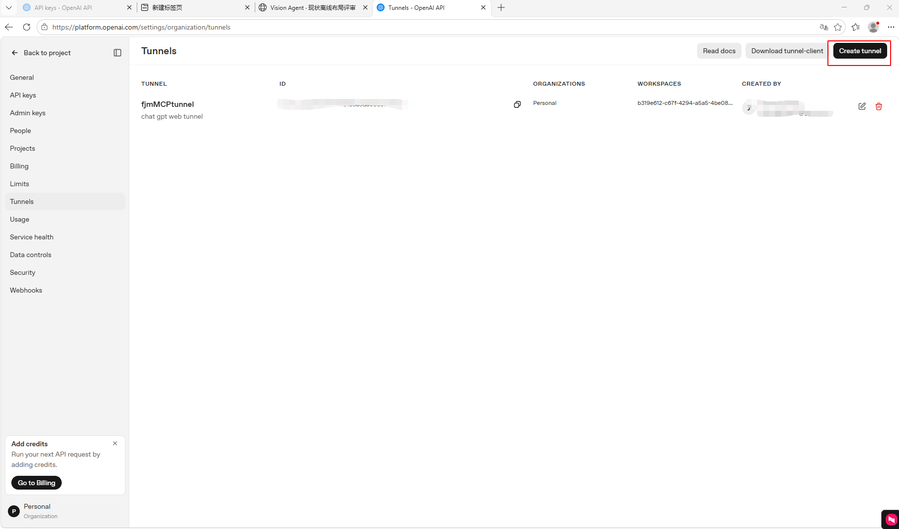
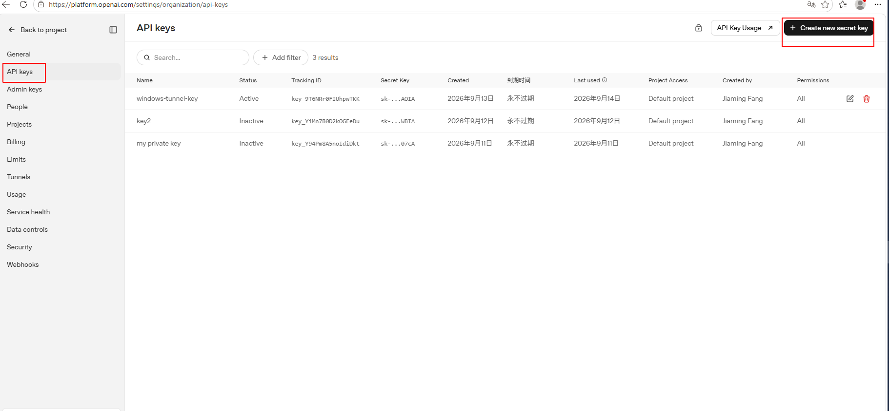
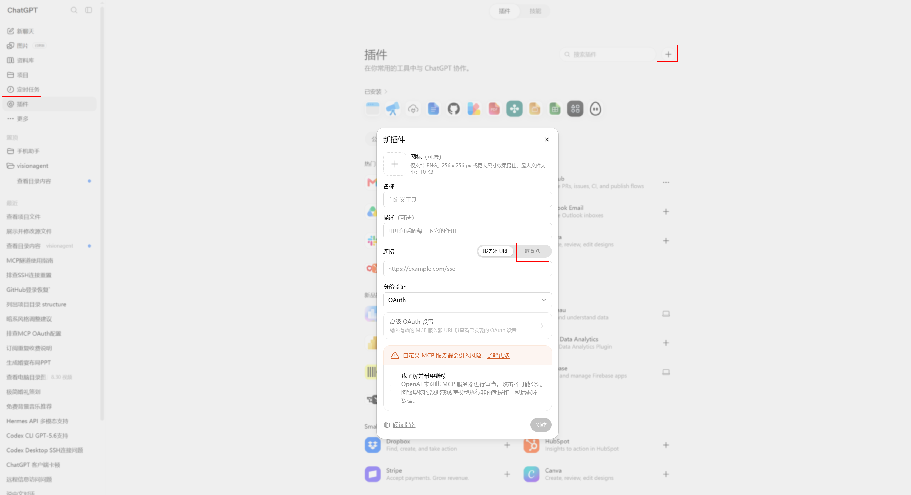

# AgentDock Secure Tunnel

让 **AgentDock** 通过 **OpenAI Secure MCP Tunnel** 接入 ChatGPT。

默认推荐 Docker 隔离：

```text
ChatGPT → Secure MCP Tunnel → tunnel-client（宿主机） → AgentDock（Docker） → 指定 workspaces
```

支持 Windows、macOS、Linux，amd64 / arm64。

## 1. 创建 OpenAI Tunnel

打开：<https://platform.openai.com/settings/organization/tunnels>

1. 点击 **Create tunnel**。
2. 填写名称、描述等信息。
3. 创建完成后复制 **Tunnel ID**。



## 2. 创建 Runtime API Key

打开：<https://platform.openai.com/settings/organization/api-keys>

创建 **Restricted Runtime API Key**，确保具备：

```text
Tunnels: Read
Tunnels: Use
```

保存生成的 API Key。



## 3. Clone 与配置

```bash
git clone https://github.com/JiamingFang1/agentdock-secure-tunnel.git
cd agentdock-secure-tunnel
```

Windows：

```powershell
Copy-Item config.example.yaml config.yaml
```

macOS / Linux：

```bash
cp config.example.yaml config.yaml
```

编辑 `config.yaml`：

```yaml
# auto = 优先使用 Docker
deployment_mode: 'auto'

# OpenAI Tunnel ID
tunnel_id: 'TUNNEL_ID_HERE'

# Restricted Runtime API Key
runtime_api_key: 'RUNTIME_API_KEY_HERE'

# AgentDock 本地端口，一般保持默认
agentdock_port: 18765

# 默认工作区名称：填写默认 path 的最后一级目录名
default_workspace: 'my-project'

workspaces:
  # WSL / Linux / macOS 目录
  - path: '/home/<user>/projects/my-project'
    mode: 'rw'

  # Windows 目录
  - path: 'D:\workspace\shared-data'
    mode: 'rw'
```

把 `Tunnel ID`、`Runtime API Key` 和 workspace 路径替换成自己的实际值即可。

## 4. 安装并启动

### Windows

```powershell
.\agentdock.cmd install
.\agentdock.cmd start
```

### macOS / Linux

```bash
./agentdock install
./agentdock start
```

正常启动后会看到类似：

```text
AgentDock : RUNNING
Tunnel    : RUNNING
Mode      : docker-wsl
Default   : my-project -> /home/agentdock/AgentDock/workspaces/my-project
MCP       : http://127.0.0.1:18765/mcp
```

以后修改 `config.yaml` 后，直接执行：

Windows：

```powershell
.\agentdock.cmd apply
```

macOS / Linux：

```bash
./agentdock apply
```

## 5. ChatGPT 网页端配置

保持 AgentDock 与 `tunnel-client` 运行，然后在 ChatGPT 网页端打开 **Settings → Apps / Connectors**（具体名称可能随 UI 版本变化）。

1. 新建 Custom MCP / App Connection。
2. **Connection** 选择 **Tunnel**。
3. 选择第 1 步创建的同一个 Tunnel。
4. 保存并让 ChatGPT 加载 AgentDock 暴露的 MCP tools。



完成后即可在 ChatGPT 中调用 AgentDock。

---

# 补充说明

下面内容不是首次安装必读，遇到配置、目录或权限问题时再查看即可。

## workspace 名称与默认目录

默认不需要写 `name`。脚本自动使用 `path` 的最后一级目录名作为 workspace 名称：

```text
/home/<user>/projects/my-project
→ my-project

D:\workspace\shared-data
→ shared-data
```

Docker 模式下对应：

```text
/home/agentdock/AgentDock/workspaces/my-project
/home/agentdock/AgentDock/workspaces/shared-data
```

如果配置：

```yaml
default_workspace: 'my-project'
```

则 AgentDock 的真实默认工作目录就是：

```text
/home/agentdock/AgentDock/workspaces/my-project
```

即：

```text
AGENTDOCK_DEFAULT_DIR=/home/agentdock/AgentDock/workspaces/my-project
```

旧版配置中的 `name` 仍然兼容，但新配置建议省略。

## workspace 读写模式

```text
rw = 可读写
ro = 只读
```

默认 workspace 必须使用：

```yaml
mode: 'rw'
```

因为 AgentDock 启动时会对默认目录执行自身的权限保护逻辑。

## Windows + WSL 混合目录

Windows 配置中可以同时使用 Windows 原生路径和 WSL 路径：

```yaml
workspaces:
  - path: 'D:\workspace\windows-project'
    mode: 'rw'

  - path: '/home/<user>/projects/linux-project'
    mode: 'rw'
```

存在 `/home/...` 这类 WSL 路径时，Docker 模式会使用 **WSL Docker Engine**。

Windows 路径会自动转换：

```text
D:\workspace\windows-project
→ /mnt/d/workspace/windows-project
```

WSL 路径保持原样。

## Docker 权限模型

Docker 模式会处理常见的 Linux / WSL UID/GID 权限问题：

- Linux / macOS：AgentDock 使用当前宿主用户的 UID/GID 运行；
- Windows + WSL Docker：AgentDock 使用默认 WSL 用户的 UID/GID 运行；
- AgentDock 内部 volume 由一次性 init 容器调整权限；
- 不会对所有 workspace 执行 `chown -R` 或 `chmod 777`。

Windows + WSL 下，启动前会检查：

```text
WSL Docker 是否可用
默认 WSL 用户 UID/GID
workspace 是否可读/可进入
rw workspace 是否可写
default_workspace 是否存在并为 rw
```

`apply` 会先完成预检，预检失败时不会先停止当前正在运行的服务。

## deployment_mode

```yaml
deployment_mode: 'auto'
```

可选值：

```text
auto    优先 Docker；没有 Docker 时询问是否使用 native
docker  强制 Docker
native  直接宿主机运行 AgentDock
```

推荐使用 Docker。

## Docker 与 native 的区别

### Docker

只把 `config.yaml` 中声明的目录挂载给 AgentDock：

```text
Host
├── /home/<user>/projects/my-project
│   → /home/agentdock/AgentDock/workspaces/my-project
│
└── D:\workspace\shared-data
    → /home/agentdock/AgentDock/workspaces/shared-data
```

未挂载的宿主机目录不会因为本项目配置自动暴露给 AgentDock。

### native

native 模式没有容器目录隔离，也无法强制执行 `ro/rw` workspace 权限。

> native AgentDock 仍可能访问当前宿主机用户有权限访问的其他目录。

如果需要“只能访问指定目录”，使用 Docker 模式。

## 安装过程会做什么

`install` 会自动：

- 识别 OS / CPU 架构；
- 下载匹配的 OpenAI `tunnel-client runtime-cloudflared` 到 `.runtime/bin/`；
- 生成 AgentDock 本地 Bearer Token；
- 根据 `deployment_mode` 选择 Docker 或 native；
- Docker 模式拉取 `ghcr.io/uvwt/agentdock:latest`；
- native 模式下载 AgentDock 官方二进制到 `.runtime/bin/`。

`config.yaml` 与 `.runtime/` 已加入 `.gitignore`，不会提交真实 Key。

## 常用命令

| 功能 | Windows | macOS / Linux |
|---|---|---|
| 安装 | `.\agentdock.cmd install` | `./agentdock install` |
| 启动 | `.\agentdock.cmd start` | `./agentdock start` |
| 应用配置 | `.\agentdock.cmd apply` | `./agentdock apply` |
| 状态 | `.\agentdock.cmd status` | `./agentdock status` |
| 日志 | `.\agentdock.cmd logs` | `./agentdock logs` |
| 重启 | `.\agentdock.cmd restart` | `./agentdock restart` |
| 停止 | `.\agentdock.cmd stop` | `./agentdock stop` |
| 更新组件 | `.\agentdock.cmd update` | `./agentdock update` |

`start` / `apply` 使用 Docker 后台模式启动，正常完成后会直接返回终端，不需要手工选择 `d Detach`。

## 项目结构

```text
.
├── README.md
├── config.example.yaml
├── agentdock.cmd
├── agentdock
├── scripts/
│   ├── bootstrap-tunnel.ps1
│   ├── bootstrap-tunnel.sh
│   ├── windows.ps1
│   └── agentdock.sh
├── docs/images/
└── .runtime/
```

上游项目：

- AgentDock: <https://github.com/uvwt/agentdock>
- OpenAI tunnel-client: <https://github.com/openai/tunnel-client>
- OpenAI Tunnel 官方说明: <https://github.com/openai/tunnel-client/blob/master/docs/end-user-guide.md>
