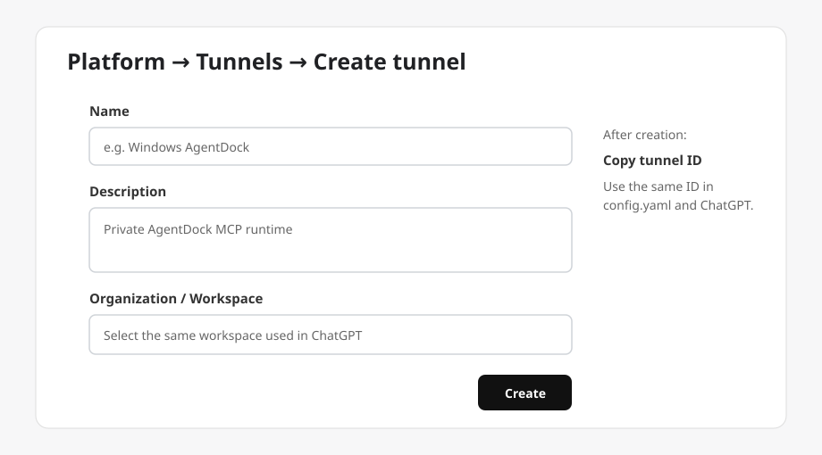
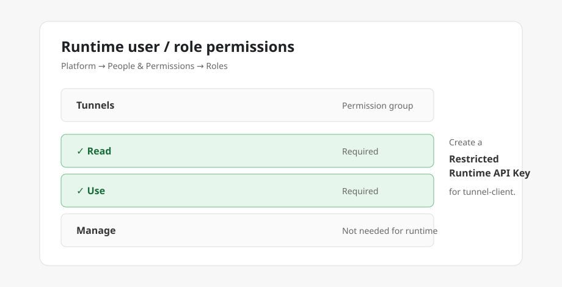
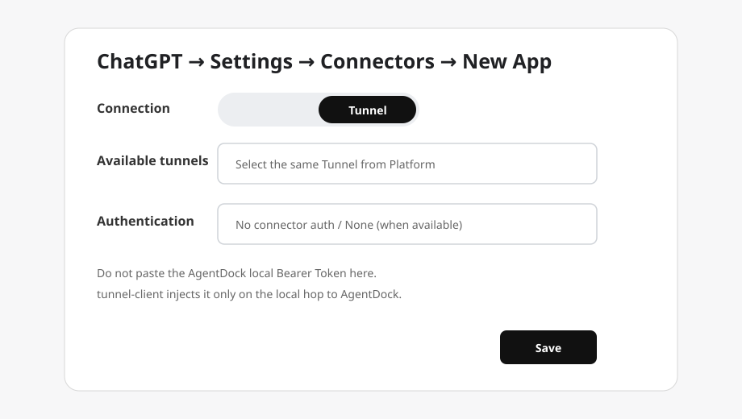

# AgentDock Secure Tunnel

让 **AgentDock** 通过 **OpenAI Secure MCP Tunnel** 接入 ChatGPT。

默认推荐 Docker 隔离：

```text
ChatGPT → Secure MCP Tunnel → tunnel-client（宿主机） → AgentDock（Docker） → 指定 workspaces
```

也支持 native 宿主机部署，但 **native 模式没有容器目录隔离**。

支持 Windows、macOS、Linux，amd64 / arm64。

## 1. 创建 OpenAI Tunnel

打开：<https://platform.openai.com/settings/organization/tunnels>

1. 点击 **Create tunnel**。
2. 填写名称、描述。
3. 选择准备在 ChatGPT 中使用的 Organization / Workspace。
4. 创建后复制 Tunnel ID。



本地 `tunnel-client` 与 ChatGPT Connector 必须使用同一个 Tunnel ID。

## 2. 创建 Runtime API Key

打开：<https://platform.openai.com/settings/organization/api-keys>

创建 **Restricted Runtime API Key**。运行 Tunnel 的用户/角色至少需要：

```text
Tunnels: Read
Tunnels: Use
```

不要给长期运行的 `tunnel-client` 使用 Admin API Key。



OpenAI 官方说明：<https://github.com/openai/tunnel-client/blob/master/docs/end-user-guide.md>

## 3. Clone 与配置

```bash
git clone https://github.com/JiamingFang1/agentdock-secure-tunnel.git
cd agentdock-secure-tunnel
```

Windows：

```powershell
Copy-Item config.example.yaml config.yaml
```

macOS / Linux：

```bash
cp config.example.yaml config.yaml
```

编辑 `config.yaml`：

```yaml
deployment_mode: 'auto'

tunnel_id: 'TUNNEL_ID_HERE'
runtime_api_key: 'RUNTIME_API_KEY_HERE'
agentdock_port: 18765

default_workspace: 'visionagent'

workspaces:
  - name: 'visionagent'
    path: 'D:\Projects\VisionAgent'
    mode: 'rw'

  - name: 'linux-project'
    path: '/home/fangjiaming/project/LinuxProject'
    mode: 'rw'

  - name: 'docs'
    path: 'D:\Documents'
    mode: 'ro'
```

说明：

- `default_workspace`：AgentDock 启动后的默认工作目录。
- `workspaces`：可挂载多个目录。
- `mode: rw`：可读写。
- `mode: ro`：只读。
- workspace `name` 只能使用字母、数字、`.`、`_`、`-`。

Docker 模式下容器内统一映射为：

```text
/workspaces/visionagent
/workspaces/linux-project
/workspaces/docs
```

`default_workspace: visionagent` 对应：

```text
AGENTDOCK_DEFAULT_DIR=/workspaces/visionagent
```

### Windows + WSL 混合目录

可以同时配置：

```yaml
workspaces:
  - name: 'windows-code'
    path: 'D:\Projects\Code'
    mode: 'rw'

  - name: 'wsl-code'
    path: '/home/fangjiaming/project/Code'
    mode: 'rw'
```

如果 Windows 配置中存在 `/home/...` 这类 WSL 路径，Docker 模式会优先要求使用 **WSL Docker Engine**。

Windows 路径会自动转换：

```text
D:\Projects\Code
→ /mnt/d/Projects/Code
```

WSL 路径保持原样。

`config.yaml` 与 `.runtime/` 已加入 `.gitignore`，不会提交真实 Key。

## 4. 安装

Windows：

```powershell
.\agentdock.cmd install
```

macOS / Linux：

```bash
./agentdock install
```

`install` 会自动：

- 识别 OS / CPU 架构；
- 下载匹配的 OpenAI `tunnel-client runtime-cloudflared` 到 `.runtime/bin/`；
- 生成 AgentDock 本地 Bearer Token；
- 根据 `deployment_mode` 选择 Docker 或 native；
- Docker 模式拉取 `ghcr.io/uvwt/agentdock:latest`；
- native 模式下载 AgentDock 官方二进制到 `.runtime/bin/`。

### deployment_mode

```yaml
deployment_mode: 'auto'
```

可选：

```text
auto    优先 Docker；没有 Docker 时询问是否使用 native
docker  强制 Docker
native  直接宿主机运行 AgentDock
```

Docker 推荐用于目录隔离。没有 Docker 时，脚本会提醒先安装 Docker Engine；只有用户确认或明确设置 `native` 才使用宿主机部署。

## 5. 启动与应用配置

Windows：

```powershell
.\agentdock.cmd start
```

macOS / Linux：

```bash
./agentdock start
```

### 修改默认目录后立即生效

例如把：

```yaml
default_workspace: 'visionagent'
```

改成：

```yaml
default_workspace: 'linux-project'
```

然后执行：

```powershell
.\agentdock.cmd apply
```

或：

```bash
./agentdock apply
```

`apply` 会重新读取 `config.yaml`、重新生成容器挂载和 `AGENTDOCK_DEFAULT_DIR`，然后重启 AgentDock 和 Tunnel。

新增、删除 workspace 或修改 `ro/rw` 后也执行同一个 `apply` 即可。

`start` 和 `restart` 同样会重新读取配置；推荐日常修改配置后直接使用 `apply`。

常用命令：

| 功能 | Windows | macOS / Linux |
|---|---|---|
| 安装 | `.\agentdock.cmd install` | `./agentdock install` |
| 启动 | `.\agentdock.cmd start` | `./agentdock start` |
| 应用配置 | `.\agentdock.cmd apply` | `./agentdock apply` |
| 状态 | `.\agentdock.cmd status` | `./agentdock status` |
| 日志 | `.\agentdock.cmd logs` | `./agentdock logs` |
| 重启 | `.\agentdock.cmd restart` | `./agentdock restart` |
| 停止 | `.\agentdock.cmd stop` | `./agentdock stop` |
| 更新组件 | `.\agentdock.cmd update` | `./agentdock update` |

正常状态示例：

```text
AgentDock : RUNNING
Tunnel    : RUNNING
Mode      : docker-wsl
Default   : visionagent
MCP       : http://127.0.0.1:18765/mcp
```

## 6. ChatGPT 网页端配置

保持 AgentDock 与 `tunnel-client` 运行，然后打开：

<https://chatgpt.com/#settings/Connectors>

1. 新建 Custom MCP / App Connection。
2. **Connection** 选择 **Tunnel**。
3. 选择刚才创建的 Tunnel，或填写相同 Tunnel ID。
4. 不要把 AgentDock 本地 Bearer Token 填进 ChatGPT；它由本机 `tunnel-client` 自动注入。
5. 如果页面显示 Authentication 选项，并允许无认证 Connector，选择 **None / No authentication**。



## Docker 与 native 的安全区别

### Docker

多个 workspace 只会把配置中列出的宿主机目录挂进容器：

```text
Host
├── D:\Projects\VisionAgent  → /workspaces/visionagent
├── /home/.../LinuxProject   → /workspaces/linux-project
└── D:\Documents             → /workspaces/docs (ro)
```

未挂载的宿主机目录不会因为本项目配置自动暴露给 AgentDock。

### native

native 模式没有挂载隔离，也无法强制执行 `ro/rw` workspace 权限。`default_workspace` 只决定 AgentDock 默认工作目录。

> native AgentDock 仍可能访问当前宿主机用户有权限访问的其他目录。

如果需要“只能接触指定目录”，使用 Docker 模式。

## 项目结构

```text
.
├── README.md
├── config.example.yaml
├── agentdock.cmd
├── agentdock
├── scripts/
│   ├── windows.ps1
│   └── agentdock.sh
├── docs/images/
└── .runtime/
```

上游项目：

- AgentDock: <https://github.com/uvwt/agentdock>
- OpenAI tunnel-client: <https://github.com/openai/tunnel-client>
